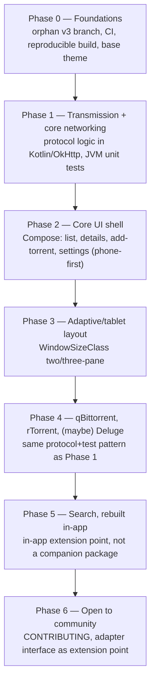

# Transdroid 3: Rewrite Plan

## Context

I am planning to start on Transdroid 3. It will be a full rewrite and redesign.

- The networking stack of Transdroid 2 is ancient and still uses the legacy Apache http client API (via org.apache.http.legacy).
- The UI is showing age and uses layers of patches upon old appcompat components that frequency break (such as the app bars recently).
- We rely on unsupported and unmaintained libraries such as androidannotations, ormlite and very old UI components.
- We still use deprecated XML layouts which get no love, and Java which no-one loves.
- There are many features poorly which might or might not work any more (search module content provider, broken tablet layout, several totally untested torrent client adapters).

A fresh start should:

- Use modern language, tooling, libraries (Kotlin, Compose UI, okhttp...)
- Focus again on most-used, most-loved, most-wanted features and clients
- Have proper CI/CD, releases on F-Droid
- Be more secure
- Have a functional and adaptive yet attractive UI
- Make it fun to work in the code base

## Design

We will keep the **grey-green branding** but adopt a platform-fitting Material 3 UI. Will support anything from small phones to foldables, tablets and large screens.

Concrete "M3 Expressive" mockups exist in [`design/mockups/`](design/mockups/) — self-contained HTML/CSS/JS files, open directly in a browser:
- `transdroid-m3-expressive.html` — main torrent list screen (light)
- `transdroid-m3-expressive-dark.html` — main torrent list screen (dark)
- `transdroid-m3-filter-drawer.html` — navigation/filter drawer
- `transdroid-m3-settings.html` — settings home
- `transdroid-m3-server-config.html` — add/edit server screen
- `transdroid-m3-details.html` — torrent details screen (light)
- `transdroid-m3-details-dark.html` — torrent details screen (dark)
- `transdroid-m3-tablet.html` — two-pane tablet layout (list + torrent details), light
- `transdroid-m3-tablet-dark.html` — two-pane tablet layout, dark

These are the source-of-truth visual reference for the screens they cover. They define:

- **Color system**: warm off-white/green-tinted M3 surface tones (`#f8faf0` → `#e0e3d7` surface-to-surface-highest) with a deep olive-green primary (`#3f6a1e`, container `#c0f39a`) — a direct evolution of v2's existing green identity (`app/src/main/res/values/colors.xml`: `#388E3C`/`#1B5E20`), now expressed as full M3 color roles instead of a handful of flat colors. Torrent-state color coding carried forward and refined: downloading=blue, seeding=green, idle/paused=grey, queued/waiting=amber, each paired with a lighter "track" tone for progress-bar backgrounds. Label/category chips get their own hue set (books=amber, music=purple, software=blue, video=teal). A dark-theme variant (`transdroid-m3-expressive-dark.html`) is designed for the torrent list screen: dark M3 surface tones (`#12140e` → `#33362d`), a lightened primary (`#a6d67e`) for contrast against dark surfaces, and brightened status/track colors — the same relationships, remapped to dark tonal roles rather than an inverted light palette.
- **Typography & iconography**: Roboto; Material Symbols Rounded (variable font) for all iconography, rounded/filled variants used consistently for filled vs. outline states.
- **Shape language ("M3 Expressive")**: heavily rounded corners throughout (22–31px radii on cards, toolbars, list rows), pill-shaped input fields and buttons, a floating bottom toolbar (aggregate DL/UL speed + active/sharing counts + quick actions: speed-limit toggle, refresh, sort) paired with a separate FAB for add-torrent that morphs shape on press.
- **Torrent list row anatomy**: leading state icon, colored state stripe, title + status tag, detail line, animated SVG "wave" progress indicator for actively-downloading torrents (falls back to a static bar for seeding/idle/queued), meta row with seeder/ratio info and live speeds.
- **Primary navigation**: a modal (not permanent) navigation drawer doubling as the filter surface — server switcher (avatar, name, connection status) at the top, a text filter field, a single-select status filter list (All/Downloading/Seeding/Completed/Paused, with live counts), a multi-select label filter list (color-coded dot per label, with counts), and a Settings entry point at the bottom. This is the mechanism that replaces whatever category/tab switching v2 used.
- **Settings screen**: content grouped into rounded card sections (Servers, RSS feeds, Preferences, Support), each list itemized with icon/title/subtitle/trailing-chevron rows; distinct "+" affordance rows for add-server/add-feed; a tinted donate/support CTA row.
- **Add/edit server screen**: for a standard server, the user first picks one of the supported server types (Transmission, rTorrent, qBittorrent) via an exposed dropdown, which swaps the connection fields shown below it.
  - For **Transmission** and **qBittorrent**, the user enters the full URL of the server's web interface in a single field. Transdroid infers the individual connection parts from it — SSL yes/no, hostname, port number, optional folder path — shown read-only in a "Detected settings" panel, with an "Override individual parts" escape hatch for the rare case the inference is wrong. This avoids making the user hand-fill host/port/path/SSL separately for the common case.
  - For **rTorrent**, which has no built-in web UI of its own, the user chooses between a **ruTorrent URL** (same single-URL-and-infer pattern as the web-UI clients, since ruTorrent is itself a web UI) or **manual SCGI details** (hostname/IP, port, optional mount path), entered directly since there's no URL to infer them from.
  - This single-URL-first, client-type-conditional layout is the reference for how the add/edit-server UI should work in Compose, and lines up with the flexible per-adapter JSON-map profile storage in [Tech stack](#tech-stack) (no fixed column set, since Transmission/qBittorrent/rTorrent each need different fields here).
- **Torrent-details screen**: `transdroid-m3-details.html` (light) and `transdroid-m3-details-dark.html` (dark) are the full-screen phone destination for a single torrent — header (state badge, name, status + label pills), a primary action row (context-sensitive play/pause/resume/"Start now", Remove, force-recheck, set-label), a large progress indicator with a summary line, then three tabs: Overview, Files, Trackers. The Overview tab is a split download/upload pair of tinted cards side by side — each with an icon+label header, a hero current-speed number, and downloaded/seeders (or uploaded/peers) rows — followed by a shared row of Ratio/Size/ETA/Added tiles below. Files shows per-file rows with a priority chip (High/Normal/Skip) and a mini progress bar; Trackers shows per-tracker rows with seed/peer counts and a working/idle status chip.
- **Two-pane tablet layout**: `transdroid-m3-tablet.html` (light) and `transdroid-m3-tablet-dark.html` (dark) combine the torrent list and the torrent-details screen above into one wide-viewport layout — a top app bar spanning both panes (title/server chip, a speed-limit toggle alongside search/refresh/sort/more, and aggregate DL/UL speed with active/sharing counts matching the phone toolbar's two-line stat format), a fixed-width list pane (filter chips + the same row anatomy as the phone list) on the left, and the details content from `transdroid-m3-details.html` on the right, updating as the selected row changes. This is the reference for how the list pane and details pane recombine into a `WindowSizeClass` two-pane layout on wider screens (Phase 3) — on narrower widths, the details pane becomes the standalone torrent-details screen (Phase 2). Both dark variants follow the same dark tonal-role remapping as `transdroid-m3-expressive-dark.html` (dark surfaces, lightened primary, brightened status colors).

## Repo & branching

Build on an **orphan `v3` branch of the existing repo** — not a new repository.

- `git checkout --orphan v3` — no shared history or file tree with `master`, so it's structurally a clean slate with zero risk of legacy code leaking in.
- `master` stays in maintenance mode (security/critical fixes only) for Transdroid 2 while `v3` is developed in parallel.
- Label issues `transdroid2` / `transdroid3`; add a short README banner clarifying `master` (stable v2) vs. `v3` (in development) while both exist.
- When `v3` is ready to ship as the primary app (around Phase 6), promote it to the default branch so the update-check URL keeps resolving, and tag the last v2 commit (e.g. `transdroid2-final`).

## Distribution

Ship on **F-Droid (reproducible build, hard requirement) and Google Play in parallel, same feature set on both**. Reuse the existing `full`/`lite` product-flavor split (`app/src/full`, `app/src/lite`) — it's already purely resource-driven with no Firebase/GMS dependency in either flavor, and `lite` already gates `search_available`/`updatecheck_available`/`rss_available` via `bools.xml`. Anything that genuinely can't ship identically on both stores goes behind a flavor-scoped bool the same way.

## Tech stack

- **UI**: Jetpack Compose with stock Material 3 (Apache 2.0, AndroidX, no F-Droid license concerns) as the component/theming base. Custom grey-green design system layered on top via color scheme/shape/typography token overrides, rather than Google's Material You dynamic-color defaults — while still keeping system integration (dynamic type, predictive back, dark theme).
- **Networking**: OkHttp directly, no Retrofit. The daemon protocols are heterogeneous (Transmission's JSON-RPC, qBittorrent's REST/cookie-auth API, rTorrent's SCGI/XML-RPC, Deluge's JSON-RPC), so a declarative-endpoint library adds friction for the non-REST ones.
  - Parse with kotlinx.serialization end-to-end: `kotlinx-serialization-json` (JetBrains-official) for the JSON-RPC/REST clients (Transmission, qBittorrent, Deluge), paired with a kotlinx.serialization-compatible XML format (e.g. `xmlutil`, which plugs into the same `@Serializable`/format-agnostic architecture) for rTorrent's XML-RPC.
  - Deserialize by streaming directly off the OkHttp response body (`Json.decodeFromStream` / the XML library's equivalent stream reader over `responseBody.byteStream()`) rather than materializing the whole response as a `String` first.
  - Avoid hand-rolled string/regex parsing of adapter responses — every response shape gets a `@Serializable` data class, so parsing is exercised by the type system and unit-testable against recorded fixtures (the same fixture-based tests already planned for Phase 1/4).
- **Persistence — general settings**: DataStore for non-sensitive app preferences. Room only if structured local storage is actually needed beyond that; a flat rolling log file (with redaction, see below) likely replaces the current single-table ORMLite error log.
- **Persistence — server profiles (sensitive data)**: server connection profiles hold IPs, ports, usernames, passwords, and API keys/secrets, and their shape varies and evolves per client type — a relational schema is the wrong fit.
  - Model each profile as a flexible string-keyed map (JSON object) rather than fixed columns, so adding/removing fields per adapter never needs a migration.
  - Encrypt the serialized blob with AES-GCM using a key held in the Android Keystore (hardware/StrongBox-backed where available — broadly supported at minSdk 29).
  - Persist via a DataStore with a custom `Serializer` that encrypts on write / decrypts on read.
  - Do not use `androidx.security.crypto`'s `EncryptedSharedPreferences` — deprecated in `security-crypto:1.1.0-alpha07` (April 2025) over keystore-corruption and main-thread performance issues on certain OEMs. If hand-rolled AES-GCM feels like too much crypto surface to own, evaluate Google Tink's `StreamingAead` wrapped in the same `Serializer` pattern instead.
  - Exclude this store from Android auto-backup (`dataExtractionRules`) — the Keystore key doesn't survive device transfer/reinstall, so a backed-up encrypted blob is dead weight and credentials shouldn't leave the device via backup.
  - Redact profile fields from the error-log feature and crash reports.
- **Concurrency**: Kotlin coroutines + Flow, replacing AsyncTask/manual threading.
- **DI**: keep it light — Koin or manual constructor injection. Skip Hilt's codegen ceremony for a solo-first phase.
- **Min/target SDK**: minSdk 29 (up from 21), dropping legacy compat code (older permission models, pre-scoped-storage handling) from day one.

## Client adapter scope

Support **Transmission first**, then **qBittorrent and rTorrent**, then **possibly Deluge**. The remaining adapters (Aria2c, BitComet, Bitflu, BuffaloNas, DLinkRouterBT, KTorrent, Synology, Tfb4rt, TTorrent, uTorrent, Vuze) are dropped from `v3`'s initial scope — revisit only if community contributors want to pick one up post-Phase 6.

## Search

Dropped for v1 — matches how the `lite` flavor already behaves. Rebuild it later as a proper in-app extension point (search providers as a pluggable implementation inside the app), not a revival of the separate companion-package/`ContentProvider` pattern.

## Roadmap

**Phase 0 — Foundations**
`git checkout --orphan v3`; GitHub Actions CI scoped to the `v3` branch (build + lint + test on every push/PR); reproducible-build setup validated against F-Droid's expectations (pinned dependency versions, no network access mid-build beyond declared repos, no proprietary blobs); base Compose theme with the grey-green identity; the `full`/`lite` flavor split carried over from day one; `transdroid2`/`transdroid3` issue labels; README banner clarifying `master` vs. `v3`.

**Phase 1 — Transmission + core networking**
Port Transmission's protocol logic to Kotlin + OkHttp, with JVM unit tests using recorded fixture responses — pure protocol/parsing code with no Android dependency, the easiest place to introduce a testing discipline that never existed before. Validates the core adapter abstraction before a second client is built against it.

**Phase 2 — Core UI shell**
Compose screens for torrent list, torrent details, add-torrent, and settings — phone-first. The torrent list, filter/nav drawer, settings home, add/edit-server, and torrent-details screens follow the mockups in [`design/mockups/`](design/mockups/); add-torrent isn't covered by those mockups yet and follows the general M3 token system described in [Design](#design).

**Phase 3 — Adaptive/tablet layout**
A `WindowSizeClass`-driven adaptive layout, replacing the three-XML-files-per-breakpoint pattern with one composable that adapts pane count explicitly by width class. `transdroid-m3-tablet.html`/`transdroid-m3-tablet-dark.html` in [`design/mockups/`](design/mockups/) are the reference for the two-pane (list + torrent-details) wide-width layout, light and dark.

**Phase 4 — qBittorrent, rTorrent, then maybe Deluge**
Same protocol + fixture-based unit test pattern as Phase 1.

**Phase 5 — Search, rebuilt in-app**
Design as an in-app extension point, not a separate companion package.

**Phase 6 — Open to community**
Once the core (networking + 2-3 screens + a handful of adapters) is stable: publish CONTRIBUTING docs, define the adapter interface as the extension point for new clients, tag good-first-issues.
